<div align="center">

# Latent Space Analysis in Genomics and Signal Processing 🧬

**Final Project | B.Sc. Data Engineering**

</div>

---

This repository contains the code, figures, and documentation for our final project:  
**Latent Space Analysis in Genomics and Signal Processing**.

The project focuses on learning latent representations from exercise ECG signals and using them as phenotypes for genetic association analysis.  
We analyzed ECG recordings from different physiological phases - **Pretest**, **Exercise**, and **Rest** - and investigated whether genetic associations differ between these phases.

---

## Project Overview

The main goal of this project was to combine deep learning and genomics in order to study the relationship between ECG signal patterns and genetic variation.

The pipeline includes:

1. Extracting ECG signals from XML files  
2. Cleaning and filtering the ECG signals  
3. Segmenting the signals into 10-second windows  
4. Training a 1D CNN Autoencoder  
5. Extracting 40-dimensional latent representations  
6. Building subject-level phenotype tables for Pretest, Exercise, and Rest  
7. Running GWAS separately for each phase  
8. Comparing genetic signals between phases  
9. Performing biological interpretation using STRING and g:Profiler  

---

## Repository Structure

```text
.
├── README.md
├── autoencoder
│   ├── build_pid_selected_latent_40x3.py
│   ├── encode_all_segments_latent.py
│   ├── plots
│   │   ├── ae_pipeline_example.png
│   │   ├── architecture_1d_cnn_autoencoder.png
│   │   ├── reconstruction_example.png
│   │   └── train_vs_validation_loss.png
│   └── train_1d_cnn_ae.py
│
├── biological_interpretation
│   ├── STRING
│   │   ├── calcium_release_channel_cluster.png
│   │   ├── cell_cell_signaling_cluster.png
│   │   ├── potassium_channel_cluster.png
│   │   └── string_network.png
│   └── g:Profiler
│       ├── gprofiler_enrichment_analysis.png
│       └── gprofiler_table.png
│
├── docs
│   ├── Final_Project.pdf
│   └── project_presentation.pptx
│
├── gwas
│   ├── build_full_phase_matrix.py
│   ├── plots
│   │   ├── mirrored_manhattan_phase_comparisons_z14.png
│   │   ├── rest_vs_exercise_difference_manhattan_z14.jpeg
│   │   ├── signal_difference_rest_exercise.jpeg
│   │   └── signal_strength_distribution.jpeg
│   ├── run_gwas.py
│   └── slurm_job_scripts
│       ├── gwas_exercise.sbatch
│       ├── gwas_pretest.sbatch
│       └── gwas_rest.sbatch
│
├── latent_analysis
│   ├── latent_analysis.py
│   └── plots
│       ├── lda_by_phase.png
│       ├── pca_by_phase.png
│       ├── tsne_by_phase.png
│       └── umap_by_phase.png
│
└── preprocessing
    ├── extract_ecgs.py
    ├── filter_signals_wavelet.py
    ├── plots
    │   └── raw_vs_cleaned_ecg.png
    └── segmentation_10s.py
```

---

## Preprocessing

The preprocessing stage converts raw ECG XML files into structured signal files.

### Files

- `extract_ecgs.py`  
  Extracts ECG signals and trend data from XML files inside ZIP archives.

- `filter_signals_wavelet.py`  
  Cleans the ECG signals using wavelet-based filtering, baseline removal, and normalization.

- `segmentation_10s.py`  
  Splits the cleaned ECG signals into non-overlapping 10-second segments and matches each segment to the corresponding physiological phase.

### Example

The following figure shows an example of an ECG signal before and after cleaning:


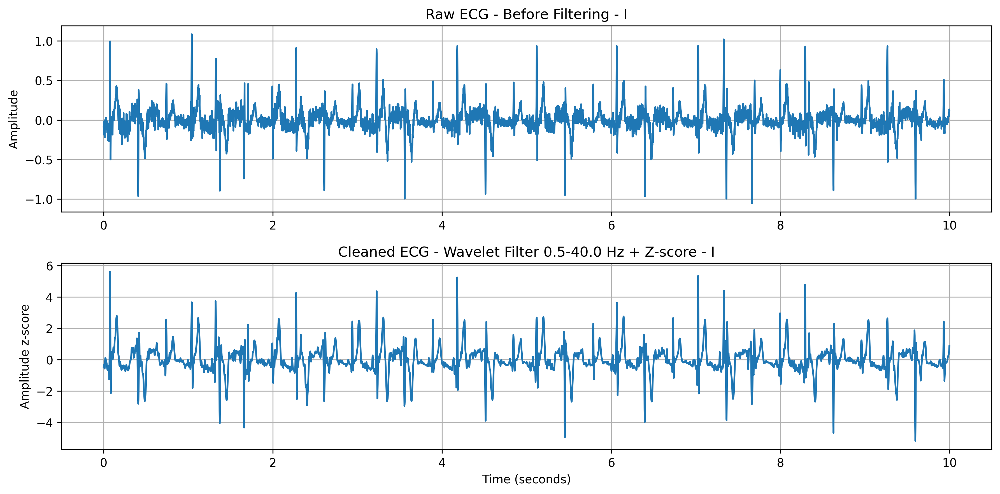


---

## Autoencoder

A 1D CNN Autoencoder was trained on the segmented ECG signals.

The model receives a multi-lead 10-second ECG segment, compresses it into a 40-dimensional latent representation, and reconstructs the original signal.

### Files

- `train_1d_cnn_ae.py`  
  Trains the final 1D CNN Autoencoder.

- `encode_all_segments_latent.py`  
  Uses the trained model to encode all ECG segments into latent vectors.

- `build_pid_selected_latent_40x3.py`  
  Builds the subject-level phenotype table.  
  For each participant, one representative segment is selected from each phase:
  - Pretest: middle segment
  - Exercise: segment closest to 30 seconds before the end of exercise
  - Rest: middle segment

This creates a final phenotype table with:

```text
40 latent features × 3 phases = 120 phenotype columns per participant
```

### Figures


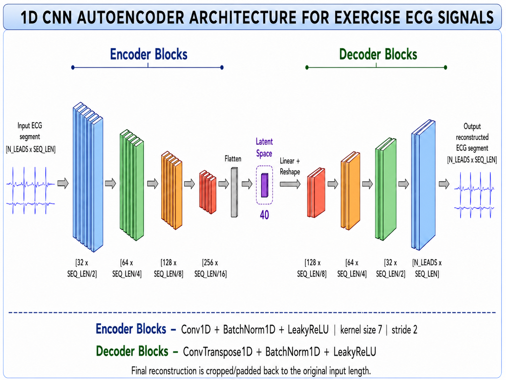

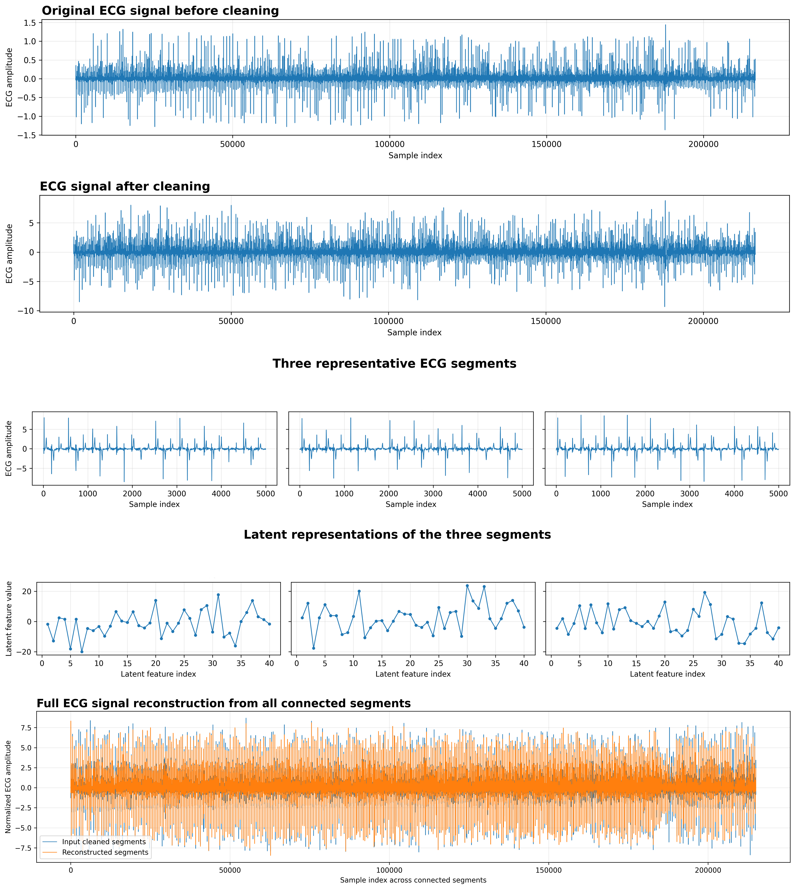

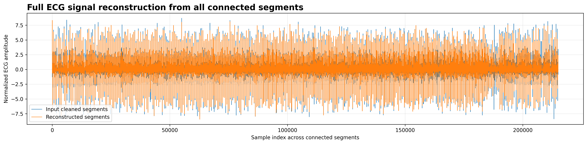

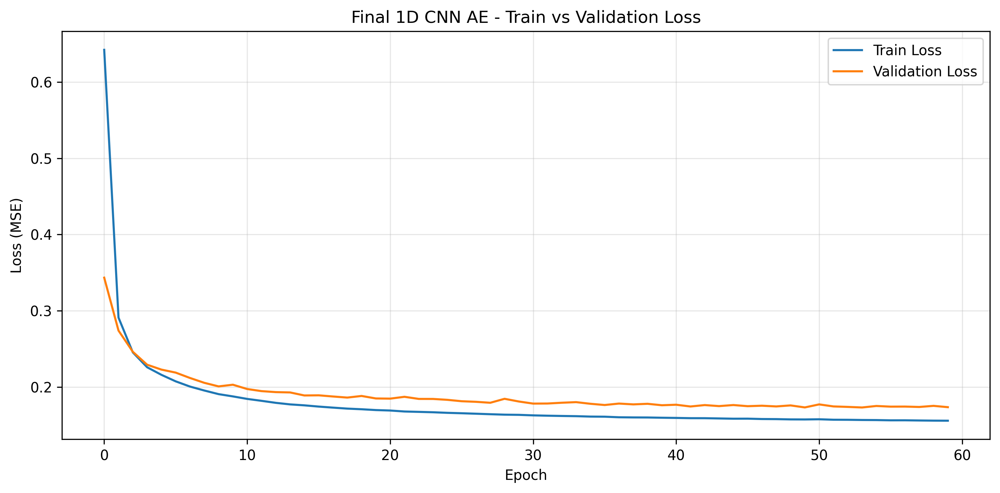


---

## Latent Space Analysis

The latent representations were analyzed in order to examine whether the learned features capture meaningful differences between ECG phases.

### File

- `latent_analysis.py`  
  Performs PCA, LDA, t-SNE, UMAP, reconstruction error analysis, and clustering on the latent space.

### Figures


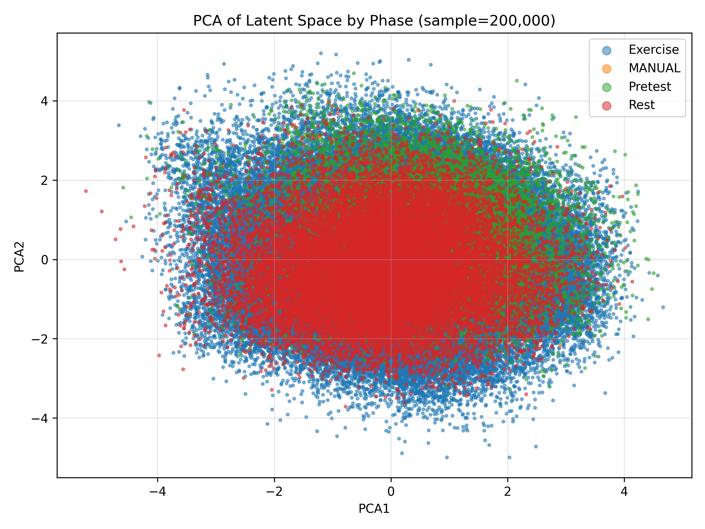

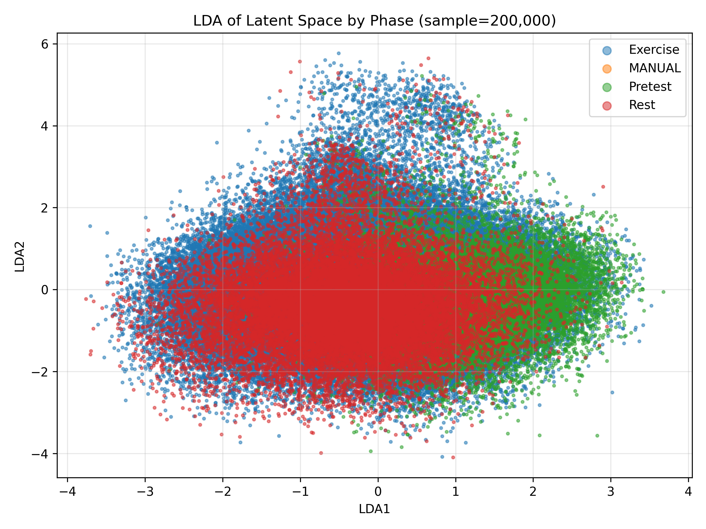

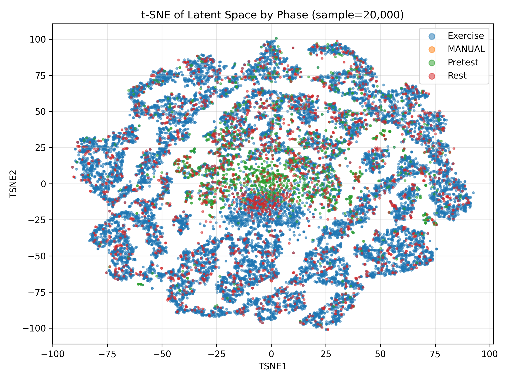

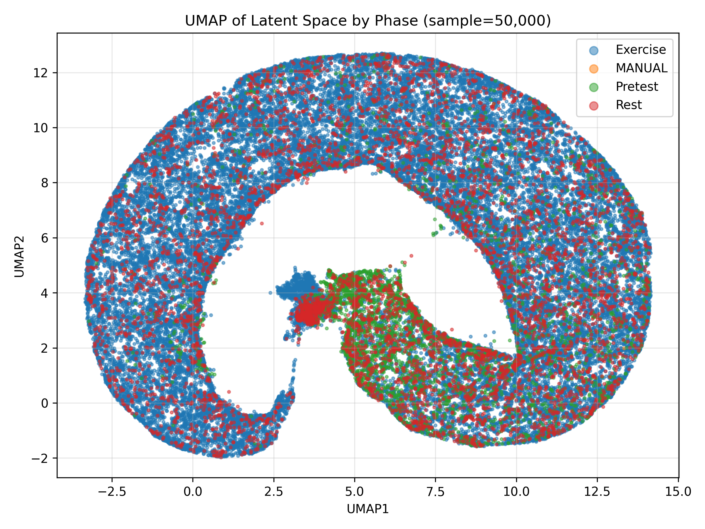


---

## GWAS Analysis

Genome-wide association studies were performed separately for each physiological phase:

- Pretest
- Exercise
- Rest

Each phase included 40 latent phenotypes.

### Files

- `run_gwas.py`  
  Runs PLINK2 GWAS for one selected phase.

- `build_full_phase_matrix.py`  
  Merges GWAS results from all phases and creates a combined phase-comparison matrix.

- `slurm_job_scripts/`  
  Contains SLURM job scripts for running GWAS separately for each phase on the cluster.

### GWAS Jobs

```text
gwas_pretest.sbatch
gwas_exercise.sbatch
gwas_rest.sbatch
```

### Figures


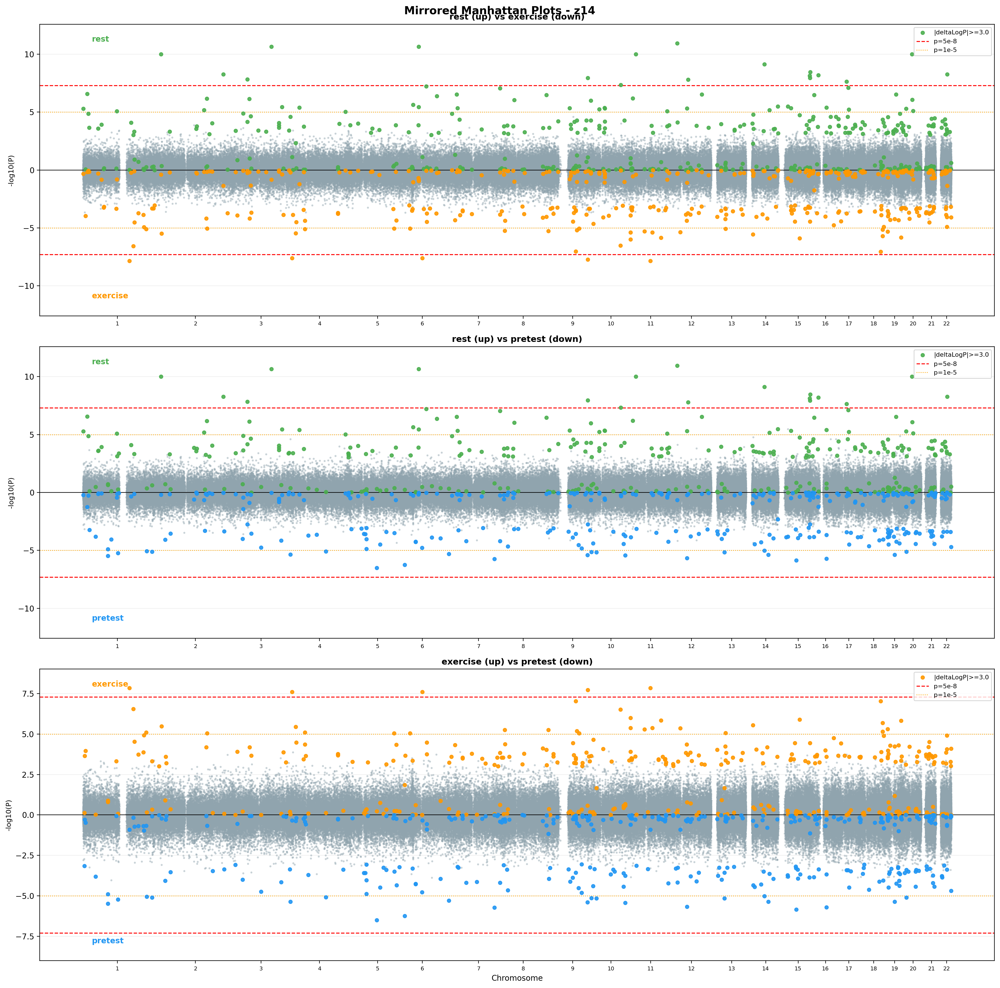

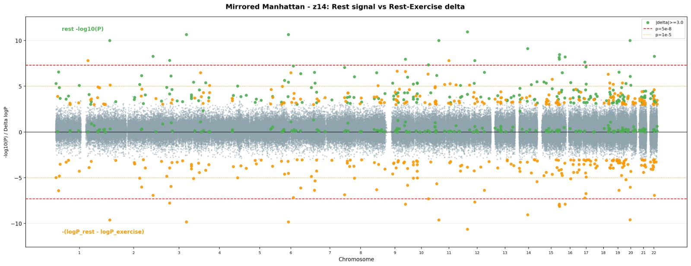

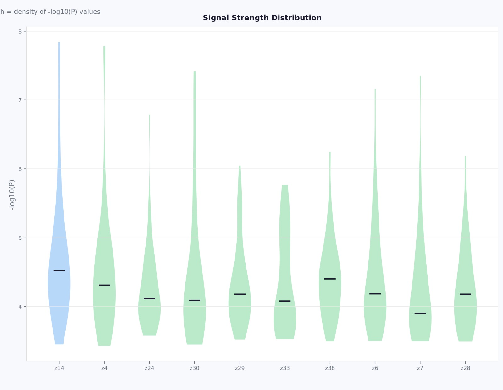

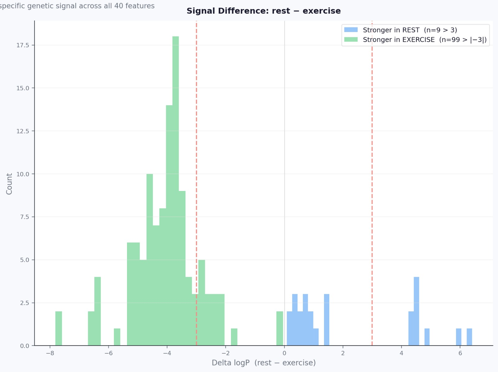


---

## Biological Interpretation

After the GWAS phase-comparison analysis, selected genes and SNPs were further examined using biological interpretation tools.

### STRING Network

STRING was used to examine functional relationships between genes.


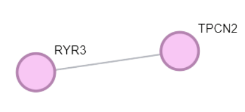

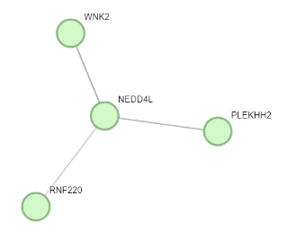

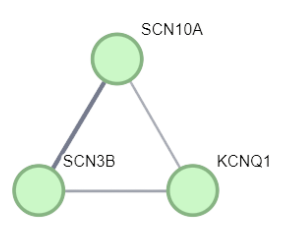


### g:Profiler

g:Profiler was used for enrichment analysis.


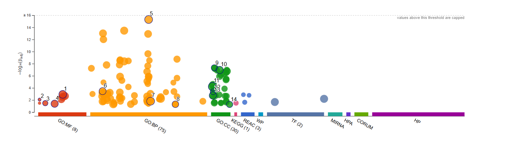

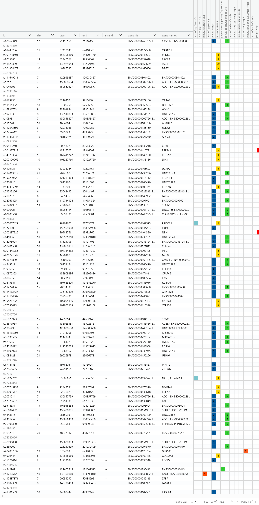


---

## Main Results

The results suggest that ECG latent features learned by the 1D CNN Autoencoder capture meaningful physiological information.

The GWAS analysis showed that some genetic associations differ between phases, especially between Rest and Exercise.  
This supports the idea that genetic effects on ECG-related features may be phase-dependent and can become more visible under exercise conditions.

---

## Requirements

Python dependencies:

```text
numpy
pandas
matplotlib
PyWavelets
scikit-learn
umap-learn
torch
```

External dependency:

```text
PLINK2
```

PLINK2 must be installed and available in the system path in order to run the GWAS analysis.

---

## Notes

The raw ECG data, genetic data, trained model files, and full GWAS outputs are not included in this repository due to privacy, size, and data access restrictions.

This repository is intended to present the final project pipeline, code structure, main figures, and documentation.

---

## Authors

Nicole Neginsky  
Gal Omesi  
Lilach Zaks  

Supervisors:  
Dr. Nadav Rappaport  
Natan Lubman
